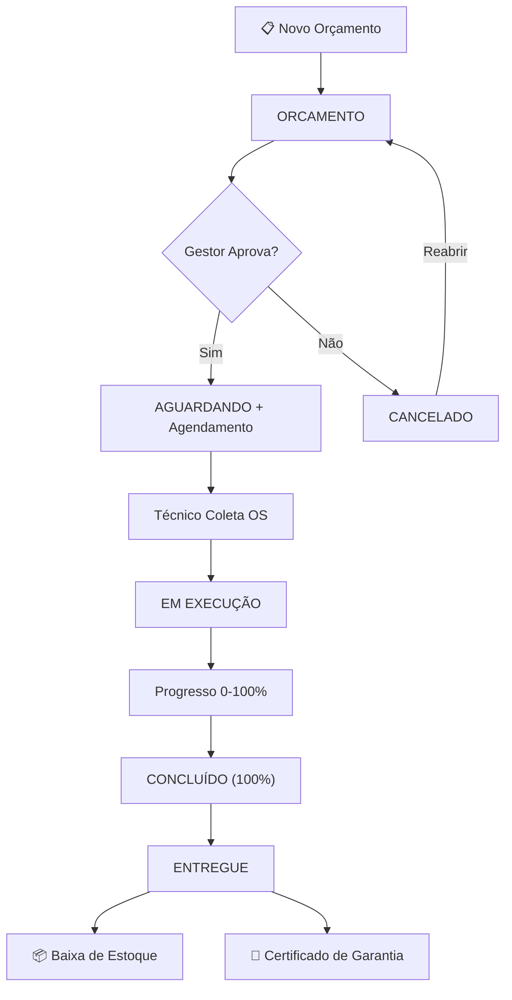
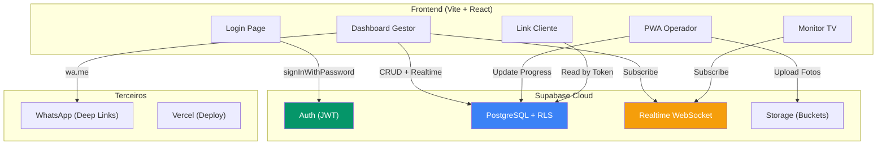

# 🔍 Avaliação Técnica Completa — OsSystem

**Projeto:** OsSystem (White Label PWA para Estética Automotiva)
**Stack:** React 18 + Vite + Supabase (Auth/DB/Realtime/Storage) + Tailwind CSS
**Plataformas:** PWA Mobile (Operador) + Web Dashboard (Gestor/ADM) + Monitor TV (Público)
**Data da Avaliação:** 07/05/2026

---

## 📊 Resumo Executivo

| Categoria | Nota | Score |
|-----------|------|-------|
| 🔄 Fluxo Operacional | **Satisfatório** | 3/4 |
| 🐛 Estabilidade / Falhas | **Moderado** | 2/4 |
| 🔒 Segurança da Informação | **Moderado** | 2/4 |
| ⚡ Performance | **Moderado** | 2/4 |
| 📖 Documentação | **Satisfatório** | 3/4 |
| 🧪 Testes | **Fraco** | 0/4 |
| 🏗️ Complexidade / Arquitetura | **Moderado** | 2/4 |
| **Média Geral** | **Moderado** | **2.0/4** |

### Top 3 Pontos Fortes
1. ✅ Fluxo operacional completo e bem definido (51 fases entregues)
2. ✅ RLS implementado em todas as tabelas com função anti-recursão
3. ✅ Arquitetura White Label com sistema de branding dinâmico

### Top 3 Lacunas Críticas
1. 🔴 **Credenciais expostas no `.env` versionado** (chave Supabase + senhas de teste)
2. 🔴 **Zero testes automatizados** em todo o projeto
3. 🔴 **Race conditions** na gestão de estoque e pagamentos

---

## 1. 🔄 Análise de Fluxo Operacional

### Fluxo Principal (Ciclo de Vida da OS)



### Pontos Positivos do Fluxo
- **Ciclo completo:** Orçamento → Aprovação → Agendamento → Execução → Entrega → Certificado
- **Integração WhatsApp:** Mensagens automáticas em cada etapa (confirmação, conclusão, certificado)
- **Link do Cliente:** Acompanhamento em tempo real via link público protegido por UUID (tracking_token)
- **Monitor TV:** Visualização real-time da produção com Supabase Realtime
- **Controle Financeiro:** Pagamentos parciais, adiantamentos e estornos

### Falhas de Fluxo Identificadas

> [!WARNING]
> #### 1.1 — Duplicação de Lógica entre `useOrders` e `useQuotes`
> Ambos os hooks operam sobre a **mesma tabela** `ordens_servico`, mas com queries e mapeamentos duplicados. Funções como `registerPayment` e `deletePayment` existem em ambos os hooks com lógica idêntica.
> - **Arquivo:** [useData.js](file:///c:/Users/caio.franca/.gemini/antigravity/scratch/OsSystem/src/hooks/useData.js)
> - **Linhas:** `useOrders` (L5-L401) vs `useQuotes` (L502-L742)
> - **Impacto:** Manutenção difícil, risco de divergência de comportamento

> [!WARNING]
> #### 1.2 — Arquivo Monolítico `useData.js` (1171 linhas)
> Todos os hooks de dados estão em um único arquivo de ~40KB. Isso dificulta manutenção, debug e code review.
> - **Recomendação:** Separar em `useOrders.js`, `useClients.js`, `useCatalog.js`, etc.

> [!NOTE]
> #### 1.3 — Status "ORCAMENTO" vs "ORÇAMENTO" (Inconsistência de Encoding)
> No banco, o status é salvo como `ORCAMENTO` (sem acento), mas na UI de filtro aparece `ORÇAMENTO` (com acento). Isso pode causar incompatibilidade de filtros.
> - **Arquivo:** [Vendas.jsx](file:///c:/Users/caio.franca/.gemini/antigravity/scratch/OsSystem/src/pages/Vendas.jsx#L44) → `statusOptions` usa "ORÇAMENTO"
> - **Arquivo:** [useData.js](file:///c:/Users/caio.franca/.gemini/antigravity/scratch/OsSystem/src/hooks/useData.js#L555) → `saveQuote` salva como `ORCAMENTO`

---

## 2. 🐛 Possíveis Falhas e Bugs

### 🔴 CRÍTICO

#### 2.1 — Race Condition na Baixa de Estoque
```
Fluxo Problemático:
1. Gestor A clica "Entregar" na OS #100
2. Gestor B clica "Entregar" na OS #100 (quase simultaneamente)
3. O check `wasAlreadyDelivered` pode falhar entre o READ e o UPDATE
4. Resultado: Estoque deduzido 2x
```
- **Arquivo:** [useData.js](file:///c:/Users/caio.franca/.gemini/antigravity/scratch/OsSystem/src/hooks/useData.js#L122-L146)
- **Causa:** Operação read-then-write sem transação atômica (deveria ser uma Stored Procedure ou Edge Function)
- **Severidade:** 🔴 Crítico — pode causar estoque negativo ou inconsistente

#### 2.2 — Race Condition em Pagamentos
```
Fluxo Problemático:
1. Dois usuários registram pagamento ao mesmo tempo
2. Ambos leem `valor_pago = 500`
3. Ambos escrevem `valor_pago = 500 + 200 = 700`
4. Resultado: Um pagamento de R$200 "sumiu"
```
- **Arquivo:** [useData.js](file:///c:/Users/caio.franca/.gemini/antigravity/scratch/OsSystem/src/hooks/useData.js#L194-L234)
- **Causa:** Operação `SELECT → calcula → UPDATE` sem lock/transação
- **Severidade:** 🔴 Crítico — pode causar perda financeira

#### 2.3 — Fallback para Telefone Hardcoded
```javascript
sendWhatsApp(cleanPhone || '11999999999', ...)
```
- **Arquivo:** [Vendas.jsx](file:///c:/Users/caio.franca/.gemini/antigravity/scratch/OsSystem/src/pages/Vendas.jsx#L108)
- **Causa:** Se o telefone do cliente estiver vazio, a mensagem vai para um número aleatório
- **Severidade:** 🔴 Crítico — dados do cliente vazam para terceiro desconhecido

### 🟡 MODERADO

#### 2.4 — Operador Tem Acesso Total à Tabela de OS
A política RLS para operadores permite `FOR ALL`:
```sql
CREATE POLICY "Gestão de OS para Operador" ON public.ordens_servico 
FOR ALL USING (auth.uid() IN (SELECT id FROM public.profiles WHERE cargo = 'OPERADOR'));
```
- **Arquivo:** [estrutura_db.md](file:///c:/Users/caio.franca/.gemini/antigravity/scratch/OsSystem/estrutura_db.md#L214)
- **Impacto:** Um operador pode **deletar ou alterar** qualquer OS, inclusive de outros técnicos
- **Recomendação:** Restringir a `SELECT` + `UPDATE` apenas nas OS atribuídas (`tecnico_id = auth.uid()`)

#### 2.5 — Realtime Channel no `CustomerStatus` com Dependency Bug
```javascript
useEffect(() => {
    fetchCustomerOrders();
    if (hasRealConnection() && orders.length > 0) { // ← orders.length é 0 na primeira renderização
      // Nunca executa na montagem!
```
- **Arquivo:** [CustomerStatus.jsx](file:///c:/Users/caio.franca/.gemini/antigravity/scratch/OsSystem/src/pages/CustomerStatus.jsx#L65-L77)
- **Impacto:** O canal Realtime só é criado após o segundo render. Na primeira visita, o cliente não recebe atualizações em tempo real até dar F5.

#### 2.6 — `fetchOrders()` Chamado em Cascata sem Debounce
Cada evento Realtime (`postgres_changes`) dispara um `fetchOrders()` completo. Se 5 OS mudarem simultaneamente, são 5 re-fetches.
- **Impacto:** Sobrecarga no banco e lag perceptível em cenários de produção com múltiplos técnicos.

#### 2.7 — Componente PageLoading com Nome de Loja Hardcoded
```jsx
<p className="...">Lucas Envelopamento</p> // ← Deveria usar useBrand()
```
- **Arquivo:** [App.jsx](file:///c:/Users/caio.franca/.gemini/antigravity/scratch/OsSystem/src/App.jsx#L45)
- **Impacto:** Quebra o conceito White Label. Toda instância mostra "Lucas Envelopamento" no loading.

### 🟢 BAIXO

#### 2.8 — Variável `initialized` não Utilizada Corretamente em `AuthContext`
```javascript
const initialized = React.useRef(false); // Declarada mas nunca usada
```
- **Arquivo:** [AuthContext.jsx](file:///c:/Users/caio.franca/.gemini/antigravity/scratch/OsSystem/src/contexts/AuthContext.jsx#L11)

#### 2.9 — Tipografia Inconsistente no Operador
Erro de digitação no histórico:
```jsx
<p>Nenhum serviço econtrado no seu histórico</p> // "econtrado" → "encontrado"
```
- **Arquivo:** [App.jsx](file:///c:/Users/caio.franca/.gemini/antigravity/scratch/OsSystem/src/App.jsx#L199)

---

## 3. 🔒 Segurança da Informação

### 🔴 VULNERABILIDADES CRÍTICAS

#### 3.1 — Credenciais Sensíveis no Repositório

> [!CAUTION]
> O arquivo `.env` contém credenciais reais do Supabase E senhas de usuários de teste:
> ```
> VITE_SUPABASE_URL="https://tgqbhgdvhprgifeskaev.supabase.co"
> VITE_SUPABASE_ANON_KEY="eyJhbGciOiJIUzI1NiIs..."
> # Credenciais de Teste
> # ADM: cf95.souza@gmail.com / 140415
> # OPERADOR: operador2@gmail.com / 140415
> ```
> - **Arquivo:** [.env](file:///c:/Users/caio.franca/.gemini/antigravity/scratch/OsSystem/.env)
> - **Nota:** O `.gitignore` INCLUI `.env`, mas a chave ANON do Supabase é pública por design (precisa de RLS). Porém, as **senhas de teste estão em texto puro** no comentário — se alguém teve acesso ao arquivo ou ao histórico Git, pode entrar no sistema.
> - **Ação Imediata:** Rotacionar todas as senhas e remover credenciais dos comentários.

#### 3.2 — Políticas RLS Públicas Excessivas
```sql
CREATE POLICY "Monitor TV Config Pública" ON public.loja_config FOR SELECT USING (true);
CREATE POLICY "Monitor TV Perfis Pública" ON public.profiles FOR SELECT USING (true);
CREATE POLICY "Monitor TV OS Pública" ON public.ordens_servico FOR SELECT USING (true);
```
- **Arquivo:** [estrutura_db.md](file:///c:/Users/caio.franca/.gemini/antigravity/scratch/OsSystem/estrutura_db.md#L217-L219)
- **Impacto:** **Qualquer pessoa com a URL do Supabase pode:**
  - Listar TODOS os perfis de funcionários (nome, email, cargo)
  - Listar TODAS as ordens de serviço (clientes, valores, telefones)
  - Acessar configurações da loja
- **Severidade:** 🔴 **Vazamento massivo de dados pessoais (LGPD)**
- **Recomendação:** Restringir as políticas públicas a colunas específicas usando Views ou limitar o que é exposto

#### 3.3 — Ausência de Validação Server-Side
Toda a validação de dados (normalização de telefone, duplicidade de clientes, limites financeiros) é feita **exclusivamente no frontend**. Um atacante pode:
1. Usar o `supabase-js` diretamente com a ANON KEY
2. Inserir dados sem validação
3. Bypassar limites de negócio (ex: registrar pagamento negativo)

- **Recomendação:** Implementar Supabase Edge Functions ou Database Functions para validação server-side

#### 3.4 — Upload de Arquivos sem Validação de Tipo/Tamanho
```javascript
const fileExt = file.name.split('.').pop(); // Aceita qualquer extensão
const fileName = `${osId}/${Date.now()}.${fileExt}`;
```
- **Arquivo:** [useData.js](file:///c:/Users/caio.franca/.gemini/antigravity/scratch/OsSystem/src/hooks/useData.js#L329)
- **Impacto:** Pode-se fazer upload de arquivos maliciosos (`.html`, `.svg` com XSS, `.exe`)
- **Recomendação:** Validar MIME type e extensão. Limitar tamanho. Configurar políticas de storage no Supabase.

### 🟡 VULNERABILIDADES MODERADAS

#### 3.5 — Gestão de Usuários via Client-Side SignUp
O modal "Novo Usuário" cria uma instância temporária do Supabase para fazer signup sem deslogar o ADM:
```javascript
const tempSupabase = createClient(
  import.meta.env.VITE_SUPABASE_URL,
  import.meta.env.VITE_SUPABASE_ANON_KEY,
  { auth: { persistSession: false } }
);
await tempSupabase.auth.signUp({ ... });
```
- **Arquivo:** [Colaboradores.jsx](file:///c:/Users/caio.franca/.gemini/antigravity/scratch/OsSystem/src/pages/Colaboradores.jsx#L242-L263)
- **Impacto:** Funciona, mas não é ideal. O cargo do user é definido pelo trigger `handle_new_user` que SEMPRE atribui `OPERADOR`, ignorando o cargo selecionado pelo admin no frontend.
- **Recomendação:** Usar Supabase Admin API (via Edge Function) para criar usuários com cargo correto.

#### 3.6 — Link de Acompanhamento do Cliente (IDOR Parcial)
A rota `/status/:id` aceita tanto UUID (`tracking_token`) quanto ID numérico:
```javascript
if (id.length > 10) { // Provável UUID
  query.eq('tracking_token', id);
} else {
  query.eq('id', id); // IDs sequenciais são previsíveis!
}
```
- **Arquivo:** [CustomerStatus.jsx](file:///c:/Users/caio.franca/.gemini/antigravity/scratch/OsSystem/src/pages/CustomerStatus.jsx#L32-L36)
- **Impacto:** Um atacante pode iterar IDs numéricos (1, 2, 3...) e ver OS de outros clientes
- **Recomendação:** Remover o fallback por ID numérico. Aceitar APENAS `tracking_token` (UUID).

#### 3.7 — Ausência de Rate Limiting
Não há limitação de tentativas de login, nem proteção contra brute force.
- **Recomendação:** Configurar rate limiting no Supabase Auth ou usar Vercel Edge Middleware.

#### 3.8 — dangerouslySetInnerHTML sem Sanitização
```jsx
<style dangerouslySetInnerHTML={{ __html: `
  @keyframes shimmer { ... }
`}} />
```
- **Arquivo:** [CustomerStatus.jsx](file:///c:/Users/caio.franca/.gemini/antigravity/scratch/OsSystem/src/pages/CustomerStatus.jsx#L250-L255)
- **Impacto:** Neste caso específico, o conteúdo é estático/seguro. Mas o padrão é perigoso e pode ser copiado com dados dinâmicos no futuro.

---

## 4. ⚡ Performance e Escalabilidade

| Problema | Impacto | Severidade |
|----------|---------|------------|
| `fetchOrders()` busca TODAS as OS a cada evento Realtime | Latência crescente com volume | 🟡 |
| Sem paginação em nenhuma listagem | Crash do browser com >500 registros | 🔴 |
| `useOrders` e `useQuotes` fazem queries duplicadas na mesma tabela | 2x carga no banco | 🟡 |
| Lazy loading apenas nas rotas, não nos componentes pesados | Bundle chunks grandes | 🟢 |
| Assinatura Base64 salva diretamente no banco | Linhas de ~100KB+ na tabela `os_midia` | 🟡 |

---

## 5. 📋 Scorecard de Maturidade (9 Categorias)

| # | Categoria | Rating | Score | Evidência |
|---|-----------|--------|-------|-----------|
| 1 | **Aritmética** | Moderado | 2/4 | Cálculos financeiros com `Number()` e `Math.max(0,...)`, sem precisão decimal rigorosa. Valores monetários como `DECIMAL(10,2)` no DB — adequado. |
| 2 | **Auditoria / Logs** | Fraco | 1/4 | Apenas `console.log`/`console.error`. Sem logging centralizado, sem audit trail de ações (quem alterou o quê). |
| 3 | **Autenticação / Controle de Acesso** | Moderado | 2/4 | Supabase Auth + RLS + RBAC funcional. Porém, políticas RLS públicas vazam dados. Operador com acesso total à tabela OS. |
| 4 | **Complexidade** | Moderado | 2/4 | Hook `useData.js` monolítico (1171 linhas). Páginas como `Vendas.jsx` (648 linhas) com lógica de negócio misturada à UI. |
| 5 | **Descentralização** | Satisfatório | 3/4 | Arquitetura White Label, configuração via banco, sem hardcodes estruturais (exceto o loading "Lucas Envelopamento"). |
| 6 | **Documentação** | Satisfatório | 3/4 | `fase.md` muito detalhado (441 linhas). `estrutura_db.md` com script SQL completo. Faltam JSDoc e README arquitetural. |
| 7 | **Riscos de Ordenação (Race Conditions)** | Fraco | 1/4 | Operações read-then-write sem transações atômicas no estoque e pagamentos. |
| 8 | **Código de Baixo Nível** | N/A | - | Aplicação web, sem manipulação de memória/assembly. Uso de `dangerouslySetInnerHTML` isolado. |
| 9 | **Testes** | Missing | 0/4 | Zero arquivos de teste encontrados no projeto. Sem Jest, Vitest, Cypress ou qualquer framework. |

---

## 6. 🚀 Roadmap de Melhorias Futuras

### 🔴 CRÍTICO (Implementar IMEDIATAMENTE)

| # | Melhoria | Esforço | Impacto |
|---|----------|---------|---------|
| 1 | **Rotacionar senhas** e remover credenciais dos comentários do `.env` | 30min | Segurança |
| 2 | **Restringir políticas RLS públicas** — criar Views limitadas para TV e Link Cliente | 2h | LGPD/Dados |
| 3 | **Remover fallback por ID numérico** em `CustomerStatus.jsx` | 15min | IDOR |
| 4 | **Remover fallback de telefone hardcoded** (`11999999999`) | 15min | Privacidade |

### 🟡 ALTO (Próximas 2-4 semanas)

| # | Melhoria | Esforço | Impacto |
|---|----------|---------|---------|
| 5 | **Criar Stored Procedures** para baixa de estoque e registro de pagamento (transações atômicas) | 4h | Integridade |
| 6 | **Implementar paginação** em `useOrders` e `useClients` | 3h | Performance |
| 7 | **Validar uploads**: MIME type whitelist (image/*), tamanho máximo 10MB | 1h | Segurança |
| 8 | **Refatorar `useData.js`** em hooks separados | 3h | Manutenção |
| 9 | **Restringir RLS do Operador**: apenas SELECT + UPDATE na própria OS | 1h | Segurança |
| 10 | **Corrigir criação de usuário**: usar Edge Function com service_role para atribuir cargo correto | 3h | Funcionalidade |

### 🟢 MÉDIO (1-2 meses)

| # | Melhoria | Esforço | Impacto |
|---|----------|---------|---------|
| 11 | **Implementar testes**: Vitest para hooks, Playwright para fluxos críticos | 8h | Qualidade |
| 12 | **Audit Trail**: tabela `audit_log` registrando ações sensíveis (pagamentos, exclusões, alterações de cargo) | 4h | Compliance |
| 13 | **Debounce no Realtime**: agrupar eventos para evitar fetch em cascata | 2h | Performance |
| 14 | **Rate Limiting**: configurar no Supabase para login e APIs públicas | 1h | Segurança |
| 15 | **Compressão de Assinatura**: converter base64 para blob e armazenar no Storage | 2h | Performance |
| 16 | **Correção White Label**: remover hardcode "Lucas Envelopamento" do PageLoading | 15min | UX |
| 17 | **Dashboard de Monitoramento**: alertas de erros (Sentry/LogRocket) | 2h | Operação |

---

## 7. 🏗️ Diagrama Arquitetural Atual



---

> [!IMPORTANT]
> ## Conclusão
> O OsSystem é um sistema **funcional e robusto** para seu propósito (51 fases entregues!), com excelente cobertura de funcionalidades. Porém, a **segurança de dados** e a **integridade transacional** são os pontos que precisam de atenção imediata antes de escalar para mais clientes no modelo White Label.
> 
> As melhorias críticas (#1-4) podem ser implementadas em **menos de 3 horas** e eliminam os maiores riscos. As melhorias de alto impacto (#5-10) consolidam o sistema para produção robusta.
